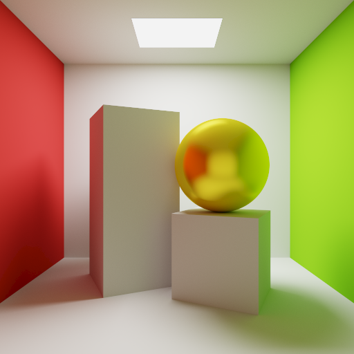

# My First Path Tracer
This project is an extension of the final project in Texas A&M's Intro to Computer Graphics course. It is a physically-based, monte-carlo path tracer. Some of its supported features are:
- Glossy Reflections
- Importance sampling via a cosine-weighted ray generation function
- Russian Roulette path termination
- Explicit light sampling
- sRGB Correction & (approximate) ACES Tonemapping curve
- Reading mesh data from .obj files

Features in progress:
- Fresnel effect
- Cook-Torrence BSDF
- Refraction

  

